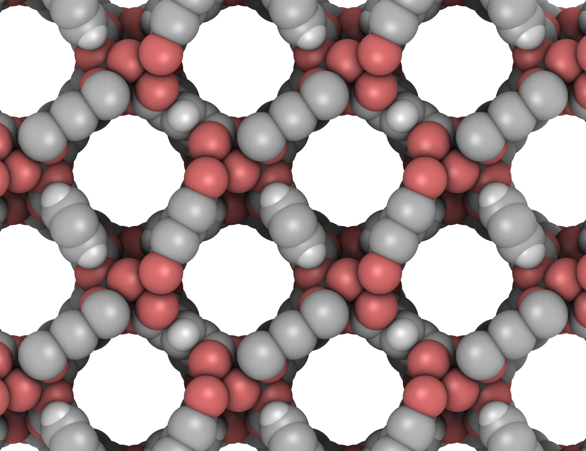

# porous materials AI gym
open data sets for machine learning pertaining to porous materials.
* MOF = metal-organic framework
* COF = covalent organic framework

## crystal structures

### experimental
* MOFs: CoRE MOFs ([Paper](https://doi.org/10.1021/acs.jced.9b00835), [Database](https://zenodo.org/record/3677685)), CSD MOF Subset ([Paper](https://pubs.acs.org/doi/abs/10.1021/acs.chemmater.7b00441), [Database](https://sites.google.com/view/csdmofsubset/home)), CSD MOF Collection ([Paper](https://doi.org/10.1016/j.matt.2021.03.006), [Database](https://www.ccdc.cam.ac.uk/Community/csd-community/csd-mof-collection/)), DFT-optimized CoRE MOFs ([Paper](https://doi.org/10.1021/acs.chemmater.6b04226), [Database](https://zenodo.org/record/3986569#.XzfKcpMzY8N)), QMOF Database ([Paper](10.1016/j.matt.2021.02.015), [Database](https://github.com/arosen93/QMOF))
* COFs: CURATED COFs ([Paper](https://pubs.acs.org/doi/10.1021/acscentsci.9b00619), [Database](https://github.com/danieleongari/CURATED-COFs)), CoRE COFs ([Paper](https://doi.org/10.1016/j.ces.2017.05.004), [Database](https://github.com/core-cof/CoRE-COF-Database))
* zeolites [link](http://www.iza-structure.org/databases/)

### hypothetical
* COFs: Mercado et al. ([Paper](https://doi.org/10.1021/acs.chemmater.8b01425)), Nanoporousmaterials.org ([Database](http://www.nanoporousmaterials.org/databases/))
* MOFs: B&W ([Paper](https://www.nature.com/articles/s41586-019-1798-7), [Database](https://doi.org/10.24435/materialscloud:2018.0016)), ToBaCCo ([Paper](https://pubs.acs.org/doi/abs/10.1021/acs.cgd.7b00848), [Database](https://mof.tech.northwestern.edu/databases)), hMOFs ([Paper](https://www.nature.com/articles/nchem.1192), [Database](https://mof.tech.northwestern.edu/databases)), Anderson et al. ([Paper](https://chemrxiv.org/articles/preprint/Deep_Learning_Combined_with_IAST_to_Screen_Thermodynamically_Feasible_MOFs_for_Adsorption-Based_Separation_of_Multiple_Binary_Mixtures/14122901/1), [Database](https://osf.io/7dgvy/)), Nanoporousmaterials.org ([Database](http://www.nanoporousmaterials.org/databases/)), QMOF Database ([Paper](10.1016/j.matt.2021.02.015), [Database](https://github.com/arosen93/QMOF))

## labeled porous materials for supervised learning

| material class | target y | features x provided? | Reference | size of data set|
| ----------- | ----------- | ----------- | ----------- | ----------- | 
| COFs (hypothetical) | CH4 deliverable capacity | yes, hand-crafted features provided. | 10.1021/acs.chemmater.8b01425 | ca. 70,000 |
| MOFs (hypothetical) | CO2, N2 adsorption | ? | 10.1038/s41586-019-1798-7 | ca. 325,000 |
| MOFs (experimental and hypothetical) | Band gaps, density of states, charge densities | [yes](https://github.com/arosen93/QMOF/tree/main/machine_learning) | [Paper](10.1016/j.matt.2021.02.015), [Database](https://github.com/arosen93/QMOF) | ca. 18,000 |
| COFs (experimental) | CH4, H2, O2, Xe, Kr, H2S adsorption | ? | 10.1021/acscentsci.0c00988 | ca. 500 |

## labeled nodes for supervised learning
| material class | experimental? | hypothetical? | target y | Reference | size of data set (# MOFs) |
| ----------- | ----------- | ----------- | ----------- | ----------- | ----------- | 
| MOFs | Y | N | DDEC6 charges on atoms | [Paper](10.1021/acs.chemmater.5b03836), [Database](https://zenodo.org/record/3986573#.XzfKiJMzY8N) | ca. 3,000 |
| MOFs | Y | Y | DDEC6/CM5/Bader charges on atoms | [Paper](10.1016/j.matt.2021.02.015), [Database](https://github.com/arosen93/QMOF) | ca. 18,000 (DDEC6/CM5), ca. 5,000 (Bader) |
| MOFs | Y| Y | Effective bond orders on atoms | [Paper](10.1016/j.matt.2021.02.015), [Database](https://github.com/arosen93/QMOF) | ca. 18,000 |
| MOFs | Y| N | Oxidation states on atoms | [Paper](https://chemrxiv.org/articles/preprint/Using_Collective_Knowledge_to_Assign_Oxidation_States/11604129/1), [Database](https://archive.materialscloud.org/record/2019.0085) | ? |
